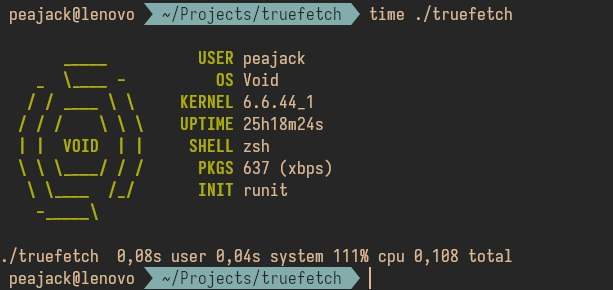

# truefetch

simple fetch-alike program, written in go

# todo

- support more distros
- support other systems (bsd, darwin, plan9, maybe even windows)
- make it faster, though idk how

# credits

logos are sincerely stolen from [afetch](https://github.com/13-CF/afetch) and [this pretty site](https://ascii.co.uk/art/linux).
stackoverflow and [gobyexample](https://gobyexample.com) are also cool places.

# uh?

feel free to test it with your distros so i can fix it, just submit an issue, or if you are so clever and have free time for this piece of ~~shit~~ masterpiece, submit a pull request
